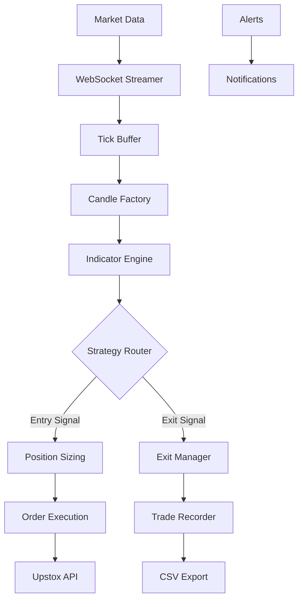
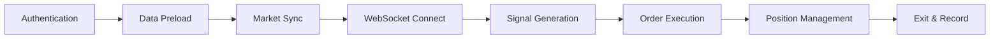

# 🚀 Upstox Algo Trading Bot

<div align="center">

[](https://www.python.org/downloads/)
[](LICENSE)
[](https://upstox.com/developer/api/)
[](CONTRIBUTING.md)

**Automated algorithmic trading system for NSE index options**  
*Real-time WebSocket streaming · Multi-timeframe analysis · Advanced risk management*

</div>

---

## 📋 Table of Contents
- [Overview](#overview)
- [Features](#features)
- [Architecture](#architecture)
- [Strategies](#trading-strategies)
- [Installation](#installation)
- [Configuration](#configuration)
- [Usage](#usage)
- [Risk Management](#risk-management)
- [Performance Reporting](#performance-reporting)
- [Contributing](#contributing)
- [License](#license)
- [Disclaimer](#disclaimer)

---

## 🔍 Overview

This is a production-ready algorithmic trading bot built on the **Upstox API V3**. It automates options trading on NSE indices using sophisticated technical analysis and real-time market data streaming.

### Key Highlights
- ✅ **Real-time WebSocket** connection for tick-by-tick data
- ✅ **Multi-timeframe analysis** (1, 3, 5, 10, 15 minutes)
- ✅ **Dynamic position sizing** based on available margin
- ✅ **ATR-based trailing stop-loss** with auto-update
- ✅ **Dry run mode** for safe backtesting
- ✅ **Comprehensive logging** and alert system
- ✅ **Trade journaling** with CSV export

---

## ✨ Features

### 📊 Data Processing
- Real-time tick aggregation into OHLC candles
- Multi-timeframe indicator calculations (ATR, MACD, EMA, RSI, ADX, VWAP, Bollinger Bands)
- Historical data preloading for accurate analysis

### 🎯 Trading Strategies

| Strategy | Description | Status |
|----------|-------------|--------|
| **MACD EMA** | MACD crossover with EMA smoothing | 🟢 **Active** |
| MACD RSI | MACD crossover + RSI confirmation | 🟡 Available |
| MACD ADX | Trend strength filter with ADX | 🟡 Available |
| VWAP RSI | VWAP breakout with RSI | 🟡 Available |
| Bollinger RSI | Mean reversion strategy | 🟡 Available |
| Golden Strategy | Hybrid trend + mean reversion | 🟡 Available |

### 🛡️ Risk Management
- **Position Sizing**: `Qty = (Margin × Risk%) / (Entry - Stop Loss)`
- **Trailing Stop**: `max(Current SL, Highest Price - ATR × 1.5)`
- **Risk per Trade**: Configurable (default 2%)
- **Risk-Reward Ratio**: Configurable (default 2:1)
- **Cooldown Period**: 30 seconds between trades

### 📈 Performance Tracking
- Automatic trade recording with entry/exit timestamps
- CSV export of all trades
- Performance metrics: win rate, profit factor, Sharpe ratio

---

## 🏗 Architecture

### System Flow



### Bot Lifecycle



### Layer Components

**🎯 Orchestration Layer**
- Bot Controller - Entry/exit logic, state management, kill switch

**📈 Processing Layer**
- Data Processor - Tick aggregation, candle formation, multi-timeframe sync

**📊 Indicator Layer**
- Calculations Engine - ATR, MACD, EMA, RSI, ADX, VWAP, Bollinger Bands

**🎲 Strategy Layer**
- Strategy Router - Signal generation, strategy selection

**🛡️ Risk Layer**
- Risk Engine - Position sizing, trailing stop, margin verification

**💾 Storage Layer**
- Data Cache - Historical data, intraday data, trade journal

**🔌 Connectivity Layer**
- WebSocket/REST Client - Real-time streaming, order placement

**📢 Alert Layer**
- Notification System - Trade events, errors, connection status

### Thread Safety
- `entry_lock` - Prevents overlapping entry signals
- `exit_lock` - Ensures atomic exit operations
- `threading.Lock()` for critical sections

---

## 📦 Installation

### Prerequisites
- Python 3.8 or higher
- Upstox API credentials (Client ID, API Key, Redirect URI)
- Upstox trading account

### Clone the Repository
``` bash
git clone https://github.com/Omega-Xi/Algo-Trading.git
cd Algo-Trading
```

### Install Dependencies
``` bash
pip install -r requirements.txt
```

### Dependencies
```
upstox-client
pandas
numpy
pytz
python-dateutil
websocket-client
```

---

## ⚙ Configuration

### 1. Configure API Credentials

``` python
# create .env file in root folder
api_key='YOUR_API_KEY'
api_secret='YOUR_API_SECRET'
redirect_url='YOUR_REDIRECT_URI'
state='YOUR_STATE_VARIABLE'
access_token='YOUR_ACCESS_TOKEN'

```

### 2. Trading Parameters

`configurations/trading_config.py`

| Parameter | Default | Description |
|-----------|---------|-------------|
| `DRY_RUN` | `True` | Paper trading mode |
| `INTERVALS` | `["1","3","5","10","15"]` | Candle timeframes |
| `ATR_MULTIPLIER` | `1.5` | Stop-loss distance |
| `RISK_PERCENT` | `2.0` | Risk per trade (%) |
| `R_TO_R_RATIO` | `2.0` | Risk-reward ratio |
| `ENTRY_COOLDOWN` | `30` | Seconds between trades |
| `SL_ATR_TIMEFRAME` | `"5"` | ATR calculation timeframe |

### 3. Select Strategy

``` python
# strategies/__init__.py
STRATEGY_MAP={
    "MACD EMA":macd_ema_strategy, # current active
    "MACD RSI":macd_rsi_strategy,
    "MACD ADX":macd_adx_strategy,
    "VWAP RSI":vwap_rsi_strategy,
    "BOLLINGER RSI":bollinger_rsi_mean_reversion,
    "DI ADX":di_adx_strategy,
    "GOLDEN STRATEGY":golden_strategy
}
STRATEGY=STRATEGY_MAP["MACD EMA"]
```

---

## 🚀 Usage

### Dry Run Mode (Recommended First)
``` bash
python -m tests.test_bot
```

### Live Trading Mode
1. Set `DRY_RUN = False` in `configurations/trading_config.py`
2. Ensure sufficient margin in your account
3. Run:
``` bash
python -m tests.test_bot
```

### Bot Lifecycle Steps
1. **Authentication**: OAuth token generation
2. **Data Preload**: Load historical and intraday futures data
3. **Market Sync**: Wait for 15-minute mark
4. **WebSocket Connection**: Start streaming real-time data
5. **Signal Generation**: Strategy analysis on each candle
6. **Order Execution**: Place orders when signals trigger
7. **Position Management**: Monitor and update trailing stops
8. **Exit**: Close position on stop-loss or target hit

---

## 🛡 Risk Management

### Position Sizing Formula
``` python
max_risk=available_margin * trading_config.RISK_PERCENT/100
max_lots_by_risk=int(max_risk//risk_per_lot)
max_lots_by_margin=int(available_margin//(option_price*lot_size))
final_lots = min(max_lots_by_risk, max_lots_by_margin)
quantity=final_lots*lot_size
```

### Trailing Stop Logic
``` python
def update_stop_loss(self):
    new_trigger_price = calculations.calculate_trigger_price(self.candle_df[SL_ATR_TIMEFRAME]['atr'].iloc[-1],self.highest_price,self.option_delta)
    self.trigger_price=max(self.trigger_price,new_trigger_price)
```

### Safety Mechanisms
- Position validation before entry
- Thread-safe operations with locks
- Kill switch for emergency shutdown
- Auto-reconnect for WebSocket
- Cooldown period between trades

---

## 📊 Performance Reporting

``` python
# Trade history export
export_trades_to_csv(transcriber.trades)
# → trade_log.csv

# Performance report
generate_performance_report(transcriber)
# Includes: win rate, profit factor, Sharpe ratio, total P&L
```

### Sample CSV Output

| instrument | type | entry_time | entry_price | quantity | trigger_price | target_price | exit_time | exit_price | pnl | status | exit_reason | gross_pnl | net_pnl | charges | _id_counter | trade_id |
|------------|------|------------|-------------|----------|---------------|--------------|-----------|------------|-----|--------|-------------|-----------|---------|---------|-------------|----------|
| NSE_FO\|57787 | PE | 2026-03-12 12:40:03.915706+05:30 | 285.45 | 195 | 257 | 342 | 2026-03-12 13:24:03.873000+05:30 | 256.75 | -5685.65 | CLOSED | STOPLOSS_HIT | -5596.50 | -5685.65 | 89.15 | 0 | 1 |
| NSE_FO\|57787 | PE | 2026-03-12 14:00:06.543682+05:30 | 263.10 | 195 | 235 | 319 | 2026-03-12 14:50:44.673000+05:30 | 319.50 | 10905.61 | CLOSED | TARGET_HIT | 10998.00 | 10905.61 | 92.39 | 0 | 2 |
---

## 🤝 Contributing

1. **Fork the repository**
2. **Create a feature branch**: `git checkout -b feature/amazing-feature`
3. **Commit changes**: `git commit -m 'Add amazing feature'`
4. **Push**: `git push origin feature/amazing-feature`
5. **Open a Pull Request**

### Development Guidelines
- Follow PEP 8 style guide
- Add docstrings to new functions
- Update README with new features
- Test thoroughly in dry run mode

---

## 📝 License

```
MIT License

Copyright (c) 2025 Omega-Xi

Permission is hereby granted, free of charge, to any person obtaining a copy
of this software and associated documentation files (the "Software"), to deal
in the Software without restriction, including without limitation the rights
to use, copy, modify, merge, publish, distribute, sublicense, and/or sell
copies of the Software, and to permit persons to whom the Software is
furnished to do so, subject to the following conditions:

The above copyright notice and this permission notice shall be included in all
copies or substantial portions of the Software.

THE SOFTWARE IS PROVIDED "AS IS", WITHOUT WARRANTY OF ANY KIND, EXPRESS OR
IMPLIED, INCLUDING BUT NOT LIMITED TO THE WARRANTIES OF MERCHANTABILITY,
FITNESS FOR A PARTICULAR PURPOSE AND NONINFRINGEMENT. IN NO EVENT SHALL THE
AUTHORS OR COPYRIGHT HOLDERS BE LIABLE FOR ANY CLAIM, DAMAGES OR OTHER
LIABILITY, WHETHER IN AN ACTION OF CONTRACT, TORT OR OTHERWISE, ARISING FROM,
OUT OF OR IN CONNECTION WITH THE SOFTWARE OR THE USE OR OTHER DEALINGS IN THE
SOFTWARE.
```

---

## ⚠ Disclaimer

**Trading involves significant risk of loss and is not suitable for all investors.** 

- Past performance does not guarantee future results
- This software is for educational purposes
- Test thoroughly in dry run mode before live trading
- The author is not responsible for any financial losses incurred
- Always verify orders and monitor the bot during live trading
- Use at your own risk

---

## 📞 Support & Contact

- **GitHub Issues**: [Report bugs or request features](https://github.com/Omega-Xi/Algo-Trading/issues)
- **Email**: omegaxi@omegaxi.in

---

<div align="center">

Made with ❤️ by Omega-Xi

⭐ **If this project helped you, please star the repository!** ⭐

</div>